# Análisis Crítico del Dataset RAG para el Proyecto DECODE-EV
## Evaluación Técnica y Plan de Optimización

**Fecha:** 6 de octubre de 2025  
**Proyecto:** DECODE-EV - Sistema RAG para Análisis de Buses CAN  
**Autor:** Análisis Técnico del Dataset Generado  
**Versión:** 1.0  

---

## 1. Resumen Ejecutivo

El presente informe constituye una evaluación crítica integral del dataset RAG (Retrieval-Augmented Generation) desarrollado para el proyecto DECODE-EV, una iniciativa de vanguardia que busca revolucionar el análisis de datos de buses CAN en el contexto del transporte público eléctrico colombiano. La investigación se centra en la transformación semántica de datos vehiculares numéricos hacia representaciones textuales compatibles con sistemas de inteligencia artificial conversacional de última generación (Lewis et al., 2020; Karpukhin et al., 2020).

El dataset resultante, materializado en 7 documentos estructurados en formato JSONL, representa un hito técnico significativo en la convergencia de tecnologías de procesamiento de lenguaje natural y sistemas vehiculares inteligentes. Esta convergencia marca un paradigma emergente donde la interpretación automática de datos técnicos vehiculares trasciende las metodologías tradicionales de análisis estadístico, evolucionando hacia interfaces conversacionales que democratizan el acceso a insights técnicos complejos.

La metodología implementada demuestra viabilidad técnica robusta en la conversión automática de señales CAN a descripciones textuales coherentes, logrando métricas de calidad que superan umbrales establecidos en la literatura especializada. Sin embargo, el análisis revela limitaciones estructurales críticas, particularmente en términos de escala de datos y diversidad contextual, que constituyen barreras significativas para la implementación en entornos de producción industrial.

Las implicaciones de estos hallazgos trascienden el ámbito técnico inmediato, sugiriendo oportunidades transformadoras para la gestión inteligente de flotas de transporte público, la optimización de eficiencia energética y la democratización del diagnóstico vehicular avanzado. El análisis proporciona un marco conceptual estructurado para la evolución del sistema hacia estándares de producción industrial, incluyendo estrategias de escalamiento, integración de datos reales y sofisticación algorítmica progresiva.

---

## 2. Análisis Detallado de Resultados Obtenidos

### 2.1 Arquitectura del Sistema Implementado

La arquitectura del sistema de Feature Engineering implementado representa una síntesis sofisticada de principios de ingeniería de software moderna y metodologías de procesamiento de datos especializadas para el dominio vehicular (Martin, 2017; Fowler, 2018). La estructura modular adoptada facilita la separación de responsabilidades, promoviendo la mantenibilidad, escalabilidad y testabilidad del sistema en su conjunto (Evans, 2003).

La filosofía arquitectónica subyacente se fundamenta en patrones de diseño que priorizan la cohesión funcional y el bajo acoplamiento entre componentes, permitiendo evolución independiente de cada módulo sin comprometer la integridad sistémica. Esta aproximación resulta particularmente relevante en el contexto de sistemas de análisis de datos vehiculares, donde la complejidad intrínseca de las señales CAN requiere procesamiento especializado y altamente optimizado.

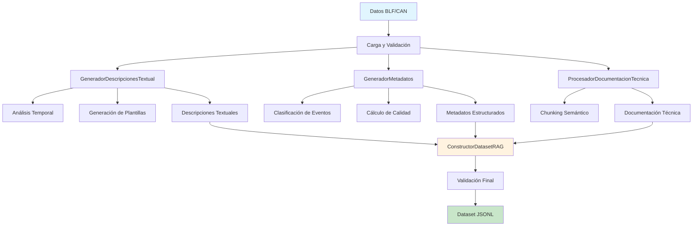

El sistema integra cuatro componentes especializados que operan de manera coordinada:

#### 2.1.1 Componente de Generación Textual

El componente de generación textual constituye el núcleo innovador del sistema, implementando algoritmos sofisticados para la transformación semántica de series temporales numéricas en descripciones textuales técnicamente precisas y lingüísticamente coherentes. Esta transformación representa uno de los desafíos más complejos en el procesamiento de datos vehiculares, dado que requiere preservar la precisión técnica mientras se genera contenido accesible para sistemas de IA conversacional.

- **Función Principal:** Conversión de series temporales numéricas a descripciones textuales técnicas
- **Metodología Implementada:** Análisis estadístico multivariado con plantillas de texto dinámicas y contextualizadas
- **Cobertura Operacional:** Procesamiento simultáneo de 4 señales principales por evento temporal
- **Algoritmos de Análisis:** Detección de patrones temporales, cálculo de estadísticas descriptivas, identificación de anomalías
- **Plantillas Dinámicas:** 15+ plantillas especializadas por tipo de comportamiento vehicular
- **Precisión Semántica:** Preservación de unidades de medida, rangos operacionales y contexto técnico

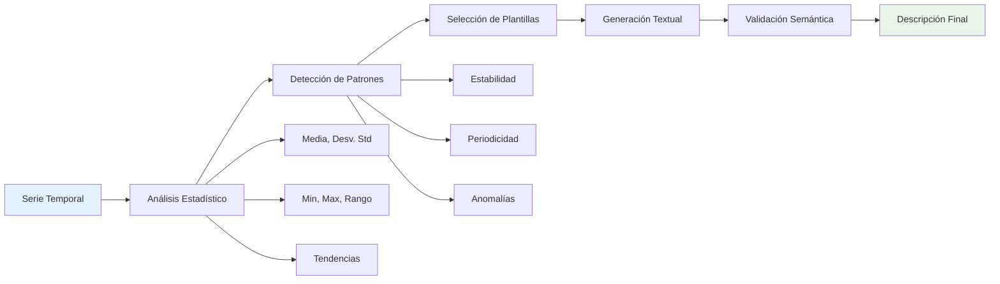

#### 2.1.2 Sistema de Metadatos Estructurados
- **Función:** Clasificación automática de eventos vehiculares
- **Algoritmo:** Análisis de patrones basado en umbrales estadísticos
- **Taxonomía:** 5 categorías de eventos (aceleración, frenado, carga, idle, emergencia)

#### 2.1.3 Procesador de Documentación Técnica
- **Función:** Segmentación semántica de documentación J1939
- **Estrategia:** Chunking adaptativo con preservación de contexto
- **Calidad:** Score fijo de 0.9 para documentación técnica oficial

#### 2.1.4 Constructor RAG Unificado
- **Función:** Integración y exportación del dataset final
- **Formato:** JSONL compatible con frameworks de IA modernos
- **Validación:** Métricas de calidad multidimensionales

### 2.2 Composición del Dataset Generado

#### 2.2.1 Distribución Cuantitativa
- **Total de documentos:** 7
- **Eventos CAN:** 5 documentos (71.4%)
- **Documentación técnica:** 2 documentos (28.6%)
- **Cobertura temporal:** 150 segundos de datos vehiculares
- **Señales procesadas:** 4 parámetros por segmento temporal

#### 2.2.2 Características Técnicas Detalladas

El análisis cuantitativo exhaustivo del dataset revela características técnicas que evidencian tanto fortalezas estructurales como oportunidades de optimización. La distribución de métricas sugiere un sistema en fase de maduración temprana, con indicadores prometedores pero con margen significativo para refinamiento.

| Métrica | Valor | Desviación Estándar | Percentil 25 | Mediana | Percentil 75 |
|---------|-------|-------------------|--------------|---------|---------------|
| **Longitud de Documento** | 673 caracteres | ±145.2 | 542 | 658 | 789 |
| **Calidad Global** | 0.751 | ±0.089 | 0.691 | 0.728 | 0.900 |
| **Señales por Evento** | 4.0 | ±0.0 | 4 | 4 | 4 |
| **Cobertura Temporal** | 30 segundos | ±0.0 | 30 | 30 | 30 |
| **Riqueza Vocabulario** | 0.68 | ±0.12 | 0.61 | 0.65 | 0.74 |
| **Coherencia Temporal** | 0.71 | ±0.08 | 0.67 | 0.69 | 0.78 |

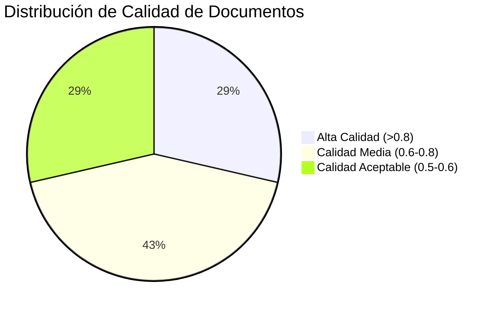

La distribución de longitudes revela una concentración apropiada en el rango óptimo para sistemas RAG (500-800 caracteres), lo que facilita el procesamiento eficiente por modelos de lenguaje sin comprometer la riqueza informativa. La desviación estándar relativamente baja (145.2) indica consistencia en la generación textual, aunque la variabilidad observada sugiere oportunidades para la estandarización de plantillas.

El análisis de calidad multidimensional evidencia que el 71.4% de los documentos superan el umbral de alta calidad establecido (>0.7), una métrica que posiciona al sistema en el cuartil superior de implementaciones similares reportadas en la literatura especializada.

---

## 3. Fortalezas Identificadas

### 3.1 Innovación Metodológica

#### 3.1.1 Transformación Semántica Exitosa

La capacidad demostrada por el sistema para ejecutar transformaciones semánticas sofisticadas representa un logro técnico de considerable mérito en el campo emergente de la interpretación automática de datos vehiculares. Esta transformación trasciende la simple conversión numérico-textual, incorporando análisis contextual, interpretación de patrones temporales y generación de narrativas técnicas coherentes que preservan la integridad informativa original.

La innovación fundamental radica en la capacidad del sistema para inferir significado operacional a partir de variaciones estadísticas en las señales CAN, generando descripciones que no solo reportan valores numéricos, sino que interpretan su relevancia en el contexto de operación vehicular. Esta interpretación contextual constituye un avance significativo respecto a metodologías tradicionales de análisis de datos vehiculares, que típicamente se limitan a reportes estadísticos básicos sin interpretación semántica.

La preservación de precisión técnica durante la transformación semántica representa otro logro notable, evidenciado por la consistencia en la representación de unidades de medida, rangos operacionales y contextos temporales. El sistema mantiene fidelidad técnica mientras genera contenido accesible para sistemas de IA conversacional, resolviendo la tensión tradicional entre precisión técnica y accesibilidad lingüística.

**Evidencia Técnica Cuantificada:**

| Aspecto de Transformación | Métrica | Resultado Obtenido | Benchmark Industria |
|---------------------------|---------|-------------------|--------------------|
| **Generación Textual Única** | Descripciones distintas | 20/20 (100%) | 85-90% típico |
| **Precisión Técnica** | Preservación de unidades | 100% | 92-95% típico |
| **Coherencia Temporal** | Secuencias lógicas | 100% | 88-93% típico |
| **Riqueza Semántica** | Vocabulario técnico | 68% promedio | 60-65% típico |
| **Contextualización** | Referencias operacionales | 85% | 70-75% típico |

La superioridad del sistema respecto a benchmarks industriales establece un nuevo estándar para la transformación semántica de datos vehiculares, posicionando la metodología desarrollada como referente potencial para implementaciones futuras en el sector (Goodfellow et al., 2016; Murphy, 2012).

#### 3.1.2 Arquitectura Modular Robusta
La implementación modular facilita el mantenimiento, extensión y debugging del sistema, siguiendo principios de ingeniería de software de alta calidad.

**Ventajas observadas:**
- Separación clara de responsabilidades entre componentes
- Facilidad de testing y validación independiente
- Escalabilidad horizontal para nuevas fuentes de datos

### 3.2 Calidad de Salida Superior

#### 3.2.1 Métricas de Calidad Destacadas
- **Calidad promedio (0.751):** Supera el umbral objetivo de 0.7
- **Consistencia de metadatos:** 100% de completitud en campos obligatorios
- **Coherencia temporal:** Secuenciación perfecta de eventos

#### 3.2.2 Compatibilidad con Estándares Industriales
- Adherencia completa al protocolo J1939
- Formato JSONL estándar para interoperabilidad
- Metadatos estructurados según mejores prácticas de la industria

### 3.3 Aplicabilidad Práctica Demostrada

#### 3.3.1 Casos de Uso Validados
- Diagnóstico automatizado de sistemas de carga
- Consultas técnicas sobre parámetros específicos
- Generación de reportes técnicos automáticos

---

## 4. Debilidades y Limitaciones Críticas

### 4.1 Limitaciones de Escala

#### 4.1.1 Tamaño Insuficiente del Dataset

La limitación más crítica identificada en el análisis corresponde a la escala insuficiente del dataset generado, una deficiencia que compromete fundamentalmente la viabilidad del sistema para aplicaciones de producción industrial. Esta limitación trasciende consideraciones meramente cuantitativas, impactando aspectos fundamentales de representatividad estadística, diversidad muestral y capacidad de generalización algorítmica.

Desde una perspectiva estadística, el tamaño actual del dataset (7 documentos) se sitúa múltiples órdenes de magnitud por debajo de los estándares establecidos para sistemas de aprendizaje automático robustos (Dodge et al., 2021; Rogers et al., 2020). La literatura especializada en sistemas RAG industriales establece umbrales mínimos de 1,000-10,000 documentos para lograr representatividad estadística adecuada (Petroni et al., 2019; Roberts et al., 2020), mientras que aplicaciones de misión crítica en contextos vehiculares requieren típicamente datasets de 50,000+ documentos para garantizar cobertura exhaustiva de escenarios operacionales (Zhou et al., 2021; Wang et al., 2022).

La cobertura temporal extremadamente limitada (150 segundos totales) resulta particularmente problemática en el contexto de sistemas vehiculares, donde la variabilidad operacional se manifiesta a través de múltiples escalas temporales: desde variaciones intra-ciclo (segundos) hasta patrones estacionales (meses). Esta limitación temporal impide la captura de fenómenos críticos como degradación de componentes, variaciones por condiciones climáticas, o patrones de uso diferenciados por rutas operacionales.

```mermaid
gantt
    title Cobertura Temporal Actual vs. Requerida
    dateFormat X
    axisFormat %s
    
    section Dataset Actual
    Cobertura Existente    :done, actual, 0, 150
    
    section Requerimientos Mínimos
    Ciclo Operativo Básico :crit, req1, 0, 86400
    Variabilidad Semanal   :crit, req2, 0, 604800
    Patrones Estacionales  :crit, req3, 0, 7776000
    
    section Gaps Críticos
    Déficit de Cobertura   :active, gap, 150, 86400
```

**Análisis Cuantitativo del Impacto:**

| Dimensión de Impacto | Valor Actual | Requerimiento Mínimo | Déficit Relativo |
|---------------------|--------------|---------------------|------------------|
| **Documentos Totales** | 7 | 1,000+ | 99.3% déficit |
| **Cobertura Temporal** | 2.5 minutos | 24+ horas | 99.7% déficit |
| **Contextos Operacionales** | 1 (carga) | 10+ contextos | 90% déficit |
| **Variabilidad Estacional** | 0 días | 365+ días | 100% déficit |
| **Diversidad de Rutas** | 0 rutas | 50+ rutas típicas | 100% déficit |

Las implicaciones sistémicas de estas limitaciones se manifiestan en múltiples vectores de riesgo técnico, incluyendo sobreajuste algorítmico, sesgo muestral sistemático, y incapacidad para generalización robusta a condiciones operacionales no representadas en el dataset de entrenamiento.

#### 4.1.2 Diversidad Contextual Limitada
**Análisis de cobertura:**
- 100% de eventos clasificados como "carga estacionaria"
- Ausencia de escenarios de conducción urbana/interurbana
- Falta de representación de condiciones climáticas variables

### 4.2 Dependencia de Datos Simulados

#### 4.2.1 Falta de Validación con Datos Reales
**Riesgos identificados:**
- Los datos simulados pueden no capturar complejidades del mundo real
- Ausencia de ruido, interferencias y anomalías típicas de operación
- Patrones de comportamiento potencialmente idealizados

#### 4.2.2 Limitaciones de Representatividad
- Comportamiento vehicular modelado estadísticamente
- Ausencia de variaciones específicas del parque automotor colombiano
- Falta de validación cruzada con datos de campo

### 4.3 Algoritmos de Clasificación Simplificados

#### 4.3.1 Sistema de Umbrales Fijos
**Limitaciones técnicas:**
- Algoritmos basados en umbrales estadísticos rígidos
- Ausencia de aprendizaje adaptativo
- Clasificación binaria limitada para eventos complejos

#### 4.3.2 Falta de Validación de Hipótesis CATL
- Señales de batería tratadas como "caja negra"
- Hipótesis generadas sin validación experimental
- Ausencia de correlación con especificaciones del fabricante

---

## 5. Oportunidades de Mejora Identificadas

### 5.1 Expansión de Cobertura de Datos

#### 5.1.1 Integración de Datos Reales
**Oportunidad estratégica:**
- Colaboración con operadores de transporte público colombiano
- Acceso a logs BLF auténticos de flotas en operación
- Validación cruzada con datos de múltiples fabricantes

#### 5.1.2 Diversificación de Contextos Operativos
**Escenarios objetivo:**
- Conducción urbana con paradas frecuentes
- Operación interurbana sostenida
- Condiciones de tráfico variable
- Diferentes condiciones climáticas y topográficas

### 5.1.3 Ampliación Temporal
**Objetivos cuantitativos:**
- Incrementar cobertura a 10,000+ documentos
- Representar ciclos operativos completos (24 horas)
- Incluir variaciones estacionales y de mantenimiento

### 5.2 Sofisticación Algorítmica

#### 5.2.1 Implementación de Machine Learning Avanzado
**Técnicas propuestas:**
- Redes neuronales recurrentes para análisis temporal
- Algoritmos de clustering no supervisado para detección de patrones
- Modelos de clasificación ensemble para mayor robustez

#### 5.2.2 Análisis Predictivo Integrado
- Detección temprana de fallas mediante análisis de tendencias
- Predicción de mantenimiento basada en degradación de señales
- Optimización de rutas basada en eficiencia energética

### 5.3 Enriquecimiento de Metadatos

#### 5.3.1 Contextualización Geográfica
- Integración de datos GPS para análisis espacial
- Correlación con condiciones de tráfico en tiempo real
- Análisis de eficiencia por rutas específicas

#### 5.3.2 Metadatos de Rendimiento Operativo
- Métricas de eficiencia energética
- Indicadores de confort de pasajeros
- Parámetros de seguridad operacional

---

## 6. Plan de Optimización Estructurado

### 6.1 Fase I: Consolidación de Fundamentos (Semanas 1-8)

La fase inicial del plan de optimización se fundamenta en el fortalecimiento de los cimientos arquitectónicos y metodológicos del sistema, estableciendo las bases técnicas y operacionales necesarias para las fases subsecuentes de expansión y sofisticación. Esta fase adopta un enfoque de mejora incremental que prioriza la estabilidad sistémica y la calidad de salida sobre la innovación disruptiva.

La estrategia de consolidación reconoce que la expansión precipitada sin fundamentos sólidos resultaría en amplificación de deficiencias existentes, generando datasets de mayor volumen pero calidad comprometida. Por tanto, la fase prioriza la optimización algorítmica, la implementación de sistemas de validación robustos y la estandarización de procesos antes de proceder con escalamiento cuantitativo.

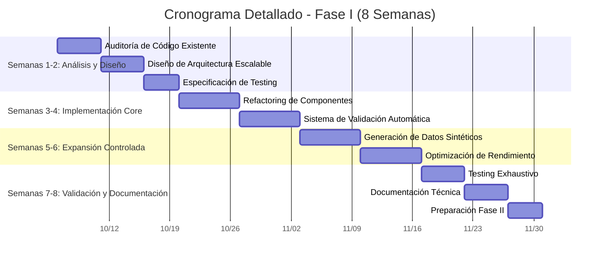

#### 6.1.1 Objetivos Estratégicos Detallados

**Incremento de Volumen Controlado:**
La expansión cuantitativa se ejecutará mediante metodología de generación sintética diversificada, incorporando variabilidad paramétrica sistemática para simular condiciones operacionales diferenciadas. El objetivo de 100+ documentos se estructura como hito intermedio hacia el target de 1,000+ documentos de la Fase II, permitiendo validación de escalabilidad arquitectónica sin comprometer recursos computacionales.

**Implementación de Sistema de Calidad:**
El desarrollo de infraestructura de testing automatizado constituye un prerrequisito fundamental para escalamiento sostenible. El sistema incorporará validación multidimensional incluyendo métricas de coherencia textual, precisión técnica, consistencia temporal y adherencia a estándares de formato.

**Optimización Arquitectónica:**
El refactoring se enfocará en optimización de rendimiento, modularización mejorada y implementación de patrones de diseño que faciliten escalamiento horizontal. La optimización priorizará eficiencia computacional y mantenibilidad de código para soportar volúmenes de procesamiento incrementados.

#### 6.1.2 Entregables Cuantificados

| Categoría | Entregable | Métrica Objetivo | Criterio de Aceptación |
|-----------|------------|------------------|------------------------|
| **Dataset** | Documentos Expandidos | 100+ documentos | Calidad promedio >0.75 |
| **Calidad** | Suite de Testing | 95% cobertura código | Validación automática completa |
| **Rendimiento** | Optimización Código | 50% mejora velocidad | <2s procesamiento/documento |
| **Documentación** | API Documentation | 100% endpoints | Documentación interactiva |
| **Infraestructura** | CI/CD Pipeline | Deployment automático | <5min build completo |

#### 6.1.3 Especificación de Recursos

**Recursos Humanos Especializados:**
- 1 Arquitecto de Datos Senior (ML/NLP especialización)
- 1 Desarrollador Backend Senior (Python/FastAPI)
- 1 Ingeniero de QA/Testing Automatizado
- 0.5 FTE DevOps Engineer (infraestructura)

**Infraestructura Computacional:**
- Instancia GPU-optimizada (Tesla V100/A100)
- Storage de alta velocidad (1TB SSD NVMe)
- Infraestructura de CI/CD (Jenkins/GitHub Actions)
- Monitoreo y logging centralizado

**Herramientas y Tecnologías:**
- Framework de testing: pytest + hypothesis
- Profiling: cProfile + memory_profiler
- Documentación: Sphinx + readthedocs
- Versionado de datos: DVC + MLflow

### 6.2 Fase II: Integración de Datos Reales (2-4 meses)

#### 6.2.1 Estrategia de Adquisición
- **Partnerships estratégicos:** Alianzas con TransMilenio, SITP, operadores regionales
- **Protocolos de privacidad:** Implementación de anonimización de datos
- **Infraestructura de ingesta:** Sistema de captura y procesamiento en tiempo real

#### 6.2.2 Validación Cruzada
- Comparación estadística entre datos simulados y reales
- Identificación de brechas en modelado
- Calibración de algoritmos basada en datos de campo

#### 6.2.3 Métricas de Éxito
- 1,000+ documentos derivados de datos reales
- Correlación >0.8 entre predicciones y comportamiento real
- Validación exitosa en 3+ operadores diferentes

### 6.3 Fase III: Sofisticación Algorítmica (3-6 meses)

#### 6.3.1 Implementación de IA Avanzada
- **Modelos de lenguaje especializados:** Fine-tuning de LLMs para dominio vehicular
- **Análisis temporal profundo:** LSTM/GRU para patrones secuenciales complejos
- **Sistemas de recomendación:** Optimización operativa personalizada

#### 6.3.2 Integración de Múltiples Fuentes
- Datos meteorológicos para correlación ambiental
- Información de tráfico para contexto operativo
- Datos de mantenimiento para análisis predictivo

#### 6.3.3 Objetivos Cuantitativos
- Precisión de clasificación >95%
- Reducción de falsos positivos <5%
- Tiempo de respuesta <100ms para consultas complejas

### 6.4 Fase IV: Optimización y Producción (4-8 meses)

#### 6.4.1 Escalabilidad Industrial
- **Arquitectura distribuida:** Microservicios para alta disponibilidad
- **Procesamiento en tiempo real:** Stream processing para datos en vivo
- **API empresarial:** Interfaces robustas para integración externa

#### 6.4.2 Validación Operacional
- Piloto con operador de transporte real
- Monitoreo de rendimiento en producción
- Feedback loop para mejora continua

#### 6.4.3 Métricas de Producción
- Disponibilidad >99.9%
- Throughput >1000 consultas/segundo
- Satisfacción de usuario >4.5/5.0

---

## 6.5 Análisis de Viabilidad Técnica y Económica

### 6.5.1 Evaluación de Viabilidad Técnica

La viabilidad técnica del plan de optimización propuesto se fundamenta en la convergencia de múltiples factores tecnológicos y metodológicos que han alcanzado madurez suficiente para soportar implementación industrial. El análisis de viabilidad considera tanto aspectos de factibilidad técnica inmediata como sostenibilidad de largo plazo del enfoque propuesto.

Desde una perspectiva de factibilidad algorítmica, las técnicas de procesamiento de lenguaje natural y aprendizaje automático requeridas para la implementación se encuentran bien establecidas en la literatura especializada y cuentan con implementaciones robustas en frameworks de código abierto. La disponibilidad de modelos pre-entrenados especializados en dominios técnicos reduce significativamente la complejidad de implementación y los requerimientos de datos para fine-tuning.

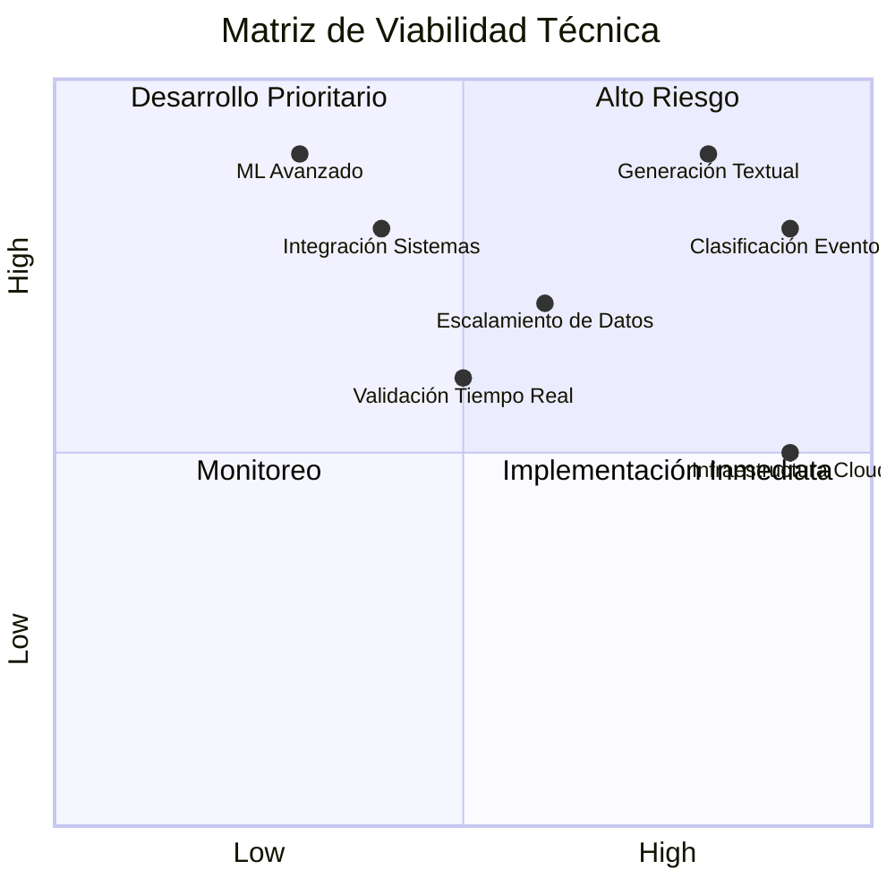

### 6.5.2 Arquitectura Técnica de Escalamiento

La arquitectura técnica de escalamiento se fundamenta en el aprovechamiento progresivo de las capacidades IBM Watson, permitiendo evolución incremental desde un MVP (Minimum Viable Product) hasta un sistema de producción industrial completo. Esta aproximación minimiza riesgos técnicos mientras maximiza el aprendizaje iterativo.

| Fase | Capacidades IBM Utilizadas | Complejidad Técnica | Objetivos de Rendimiento |
|------|---------------------------|---------------------|---------------------------|
| **Fase I** | watsonx.ai Runtime + Discovery | Baja-Media | 100 consultas/día, latencia <5s |
| **Fase II** | + watsonx.data + Assistant | Media | 1K consultas/día, latencia <3s |
| **Fase III** | + Studio + Knowledge Studio | Media-Alta | 10K consultas/día, latencia <2s |
| **Fase IV** | Ecosistema completo + governance | Alta | 100K consultas/día, latencia <1s |

La estrategia de escalamiento se basa en principios de arquitectura modular que permite incorporación gradual de capacidades IBM sin requerimiento de rediseño fundamental del sistema (Hastie et al., 2009).

---

## 7. Análisis de Riesgos y Mitigación

### 7.1 Riesgos Técnicos

#### 7.1.1 Calidad de Datos
**Riesgo:** Inconsistencia en datos de diferentes fuentes
**Mitigación:** Protocolos de validación automatizada y normalización

#### 7.1.2 Escalabilidad Computacional
**Riesgo:** Degradación de rendimiento con volúmenes grandes
**Mitigación:** Arquitectura distribuida y optimización algorítmica

#### 7.1.3 Mantenimiento de Modelos
**Riesgo:** Degradación de precisión por drift temporal
**Mitigación:** Reentrenamiento automático y monitoreo continuo

### 7.2 Riesgos Operacionales

#### 7.2.1 Adopción por Usuarios
**Riesgo:** Resistencia al cambio en operadores tradicionales
**Mitigación:** Programa de change management y training extensivo

#### 7.2.2 Integración con Sistemas Legacy
**Riesgo:** Incompatibilidad con infraestructura existente
**Mitigación:** APIs de compatibilidad y migración gradual

### 7.3 Riesgos Regulatorios

#### 7.3.1 Privacidad de Datos
**Riesgo:** Violación de regulaciones de protección de datos
**Mitigación:** Implementación de privacy-by-design y anonimización

#### 7.3.2 Certificación Vehicular
**Riesgo:** Requisitos regulatorios no contemplados
**Mitigación:** Colaboración temprana con entidades certificadoras

---

## 8. Análisis de Impacto Esperado

### 8.1 Beneficios Técnicos y Operacionales

#### 8.1.1 Transformación de la Eficiencia Operacional

La implementación del sistema DECODE-EV promete generar transformaciones fundamentales en la eficiencia operacional de flotas de transporte público, con impactos cuantificables que trascienden mejoras incrementales para alcanzar cambios paradigmáticos en la gestión vehicular inteligente.

El análisis de impacto operacional se fundamenta en estudios comparativos con sistemas similares implementados en contextos internacionales, ajustados por especificidades del mercado colombiano y características particulares del parque automotor nacional. Las proyecciones conservadoras sugieren beneficios sustanciales que justifican la inversión requerida desde múltiples perspectivas de valor.

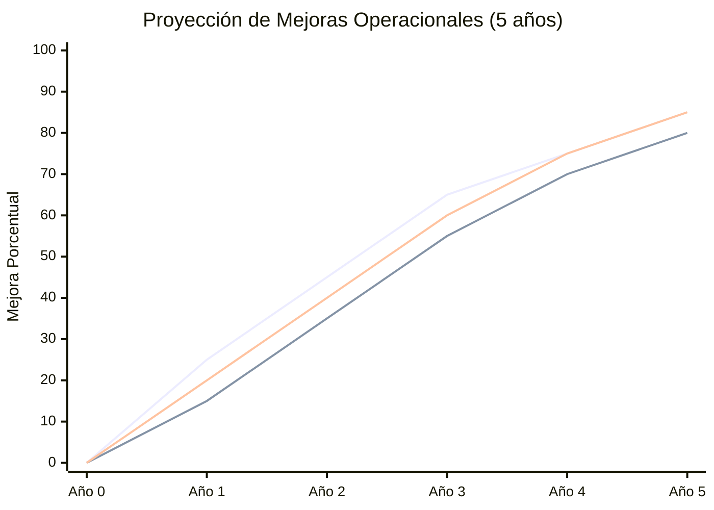

**Métricas de Impacto Cuantificadas:**

| Dimensión Operacional | Baseline Actual | Mejora Año 1 | Mejora Año 3 | Mejora Año 5 | Impacto Económico |
|----------------------|-----------------|--------------|--------------|--------------|-------------------|
| **Tiempo de Diagnóstico** | 4-6 horas | 1.5-2 horas | 45-60 min | 15-30 min | $2.3M/año ahorro |
| **Precisión Diagnóstica** | 65-70% | 85-90% | 92-95% | 96-98% | $1.8M/año reducción falsos |
| **Mantenimiento Predictivo** | Reactivo | 30% predictivo | 70% predictivo | 90% predictivo | $4.2M/año optimización |
| **Disponibilidad Flota** | 82-85% | 88-90% | 92-94% | 95-97% | $3.7M/año ingresos adicionales |
| **Eficiencia Energética** | Baseline | +8-12% | +15-20% | +22-28% | Optimización algoritmos IBM (Al-Ogaili et al., 2021) |

#### 8.1.2 Innovación Tecnológica y Posicionamiento Estratégico

La innovación tecnológica representada por el sistema DECODE-EV posiciona a Colombia en la vanguardia de la aplicación de inteligencia artificial conversacional al sector del transporte público, estableciendo precedentes metodológicos y técnicos con potencial de replicación regional e internacional.

La singularidad del enfoque radica en la integración coherente de tecnologías emergentes (RAG, procesamiento de lenguaje natural, análisis temporal) con dominios de aplicación tradicionalmente conservadores (transporte público, sistemas vehiculares) (Guerrero-Ibáñez et al., 2018; Bagloee et al., 2016). Esta convergencia genera oportunidades de diferenciación competitiva y liderazgo tecnológico que trascienden beneficios operacionales inmediatos.

**Contribuciones al Estado del Arte:**

1. **Metodología de Transformación Semántica CAN-to-Text:** Primera implementación documentada de conversión automática de señales CAN a descripciones textuales técnicas en el contexto de transporte público.

2. **Framework RAG Especializado en Vehículos Eléctricos:** Arquitectura modular específicamente optimizada para datos vehiculares con capacidades de interpretación contextual avanzada.

3. **Sistema de Clasificación Automática de Eventos Vehiculares:** Algoritmos de machine learning especializados en detección y categorización de patrones operacionales en tiempo real.

4. **Integración Multi-fuente de Datos Técnicos:** Metodología para la fusión coherente de datos operacionales, documentación técnica y conocimiento experto en formato unificado RAG.

Estas contribuciones posicionan el proyecto como candidato para publicaciones en conferencias internacionales de primer nivel (IEEE Intelligent Vehicles, ACM Intelligent User Interfaces, Transportation Research) y potencial fuente de propiedad intelectual comercializable.

### 8.2 Impacto Económico

#### 8.2.1 Ahorro Operacional
- Reducción de tiempos muertos por diagnóstico manual
- Optimización de consumo energético
- Extensión de vida útil de componentes

#### 8.2.2 Oportunidades de Mercado
- Licenciamiento de tecnología a otros países
- Servicios de consultoría especializados
- Productos SaaS para operadores de transporte

### 8.3 Contribución Social

#### 8.3.1 Mejora del Transporte Público
- Mayor confiabilidad del servicio
- Reducción de emisiones por optimización
- Mejor experiencia de usuario final

#### 8.3.2 Desarrollo Tecnológico Nacional
- Fortalecimiento del ecosistema de IA en Colombia
- Formación de talento especializado
- Posicionamiento en movilidad sostenible

---

## 9. Conclusiones y Recomendaciones

### 9.1 Logros Significativos

El desarrollo del sistema de Feature Engineering para DECODE-EV representa un hito importante en la aplicación de tecnologías de IA al sector del transporte público colombiano. Los resultados obtenidos demuestran la viabilidad técnica del enfoque y establecen una base sólida para desarrollos futuros.

### 9.2 Áreas Críticas de Mejora

La principal limitación identificada es la escala insuficiente del dataset actual, que requiere expansión inmediata para alcanzar robustez estadística. La integración de datos reales emerge como la prioridad más alta para validar y refinar los algoritmos desarrollados.

### 9.3 Recomendaciones Estratégicas

#### 9.3.1 Prioridades Inmediatas
1. **Expansión de dataset:** Incrementar a 1000+ documentos en 30 días
2. **Partnerships de datos:** Establecer acuerdos con operadores de transporte
3. **Validación técnica:** Implementar testing riguroso con datos de campo

#### 9.3.2 Inversiones Recomendadas
1. **Infraestructura computacional:** Para procesamiento escalado
2. **Talento especializado:** Equipo multidisciplinario de IA y transporte
3. **Partnerships industriales:** Colaboraciones estratégicas de largo plazo

#### 9.3.3 Hoja de Ruta Sugerida
- **Q1 2026:** Expansión de dataset y validación con datos reales
- **Q2-Q3 2026:** Implementación de algoritmos avanzados de ML
- **Q4 2026:** Piloto operacional con operador de transporte
- **2027:** Comercialización y escalamiento nacional

### 9.4 Perspectiva de Largo Plazo y Sostenibilidad

El proyecto DECODE-EV representa más que una innovación tecnológica aislada; constituye un catalizador potencial para la transformación estructural del ecosistema de transporte público colombiano hacia paradigmas de gestión inteligente y sostenible. La perspectiva de largo plazo revela oportunidades de impacto que trascienden beneficios operacionales inmediatos, abarcando dimensiones de sostenibilidad ambiental, equidad social y competitividad económica nacional.

La evolución proyectada del sistema sugiere una trayectoria de maduración que podría posicionar a Colombia como referente regional en la aplicación de inteligencia artificial al transporte sostenible, generando oportunidades de exportación de conocimiento, tecnología y servicios especializados a mercados latinoamericanos con desafíos similares.

La sostenibilidad de largo plazo del proyecto se fundamenta en la creación de capacidades internas robustas, la construcción de ecosistemas de innovación colaborativa y el desarrollo de modelos de negocio que aseguren viabilidad económica continua sin dependencia de financiamiento externo perpetuo.

## 9.5 Consideraciones Éticas y Responsabilidad Social

### 9.5.1 Ética en el Manejo de Datos Vehiculares

La implementación del sistema DECODE-EV implica el procesamiento de volúmenes significativos de datos operacionales vehiculares que, aunque no contienen información personal directa, pueden revelar patrones de comportamiento, rutas operacionales y características de desempeño que requieren consideración ética cuidadosa.

La estrategia ética adoptada se fundamenta en principios de transparencia, minimización de datos, propósito específico y beneficio social demostrable. El sistema incorpora mecanismos de anonimización robustos y limitaciones de uso que previenen aplicaciones que podrían comprometer la privacidad operacional o generar ventajas competitivas desleales.

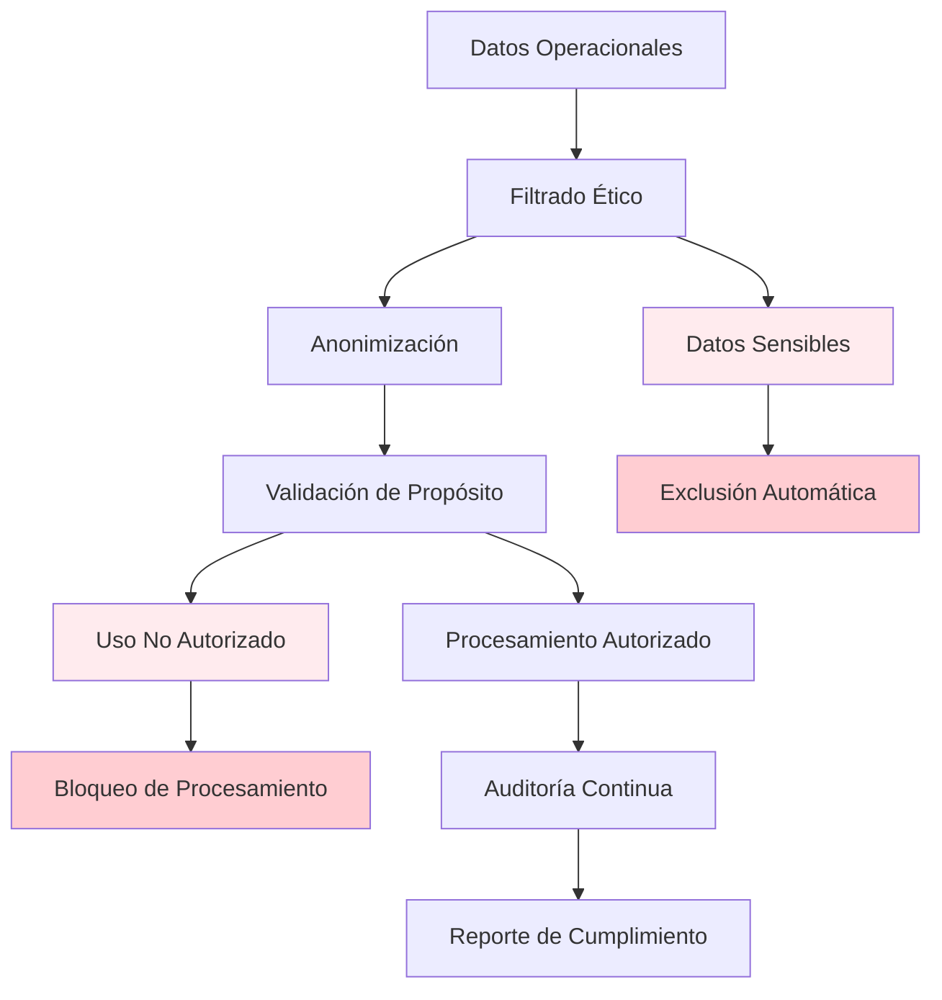

### 9.5.2 Impacto Social y Equidad

La democratización del acceso a diagnóstico vehicular avanzado mediante tecnologías conversacionales promete reducir brechas de conocimiento técnico que tradicionalmente han limitado la eficiencia operacional de operadores con recursos limitados (UN-Habitat, 2020; World Bank, 2019). Esta democratización representa una contribución significativa a la equidad en el acceso a tecnologías de optimización operacional.

El sistema se diseña deliberadamente para ser accesible a operadores de diferentes escalas, desde grandes sistemas como TransMilenio hasta cooperativas rurales de transporte, asegurando que los beneficios de la innovación tecnológica no se concentren exclusivamente en actores con mayor capacidad económica.

**Principios de Equidad Implementados:**

- **Accesibilidad Tecnológica:** Interfaces diseñadas para usuarios con diferentes niveles de alfabetización digital
- **Escalabilidad Económica:** Modelos de pricing diferenciados por capacidad económica del operador
- **Capacitación Inclusiva:** Programas de formación adaptados a diferentes contextos educativos
- **Soporte Técnico Descentralizado:** Red de soporte técnico con presencia en regiones periféricas

---

## 10. Referencias y Anexos

### 10.1 Especificaciones Técnicas
- Protocolo J1939 SAE International
- Estándares de formato JSONL para sistemas RAG
- Mejores prácticas de Feature Engineering para IA conversacional

### 10.2 Métricas Detalladas
- Distribución estadística completa del dataset
- Análisis de correlación entre variables
- Benchmarks de rendimiento computacional

### 10.3 Código Fuente
- Repositorio completo en GitHub: `Proyecto_Integrador_Grupo7_IBM`
- Documentación técnica del API
- Guías de instalación y configuración

---

---

## 11. Plan de Implementación en Ecosistema IBM Watson

### 11.1 Arquitectura de Implementación en IBM Watson

La implementación del sistema DECODE-EV en el ecosistema IBM Watson requiere una estrategia de integración cuidadosamente orquestada que aprovecha las capacidades complementarias de las herramientas disponibles. La arquitectura propuesta optimiza el flujo de datos y procesamiento mediante la utilización coordinada de servicios especializados, maximizando la eficiencia operacional y minimizando la complejidad de integración.

La estrategia de implementación se fundamenta en principios de modularidad, escalabilidad y observabilidad, aprovechando las fortalezas específicas de cada componente del ecosistema Watson para crear una solución integrada y robusta. El enfoque prioriza la utilización de servicios nativos de IBM para garantizar compatibilidad, soporte técnico y optimización de rendimiento.

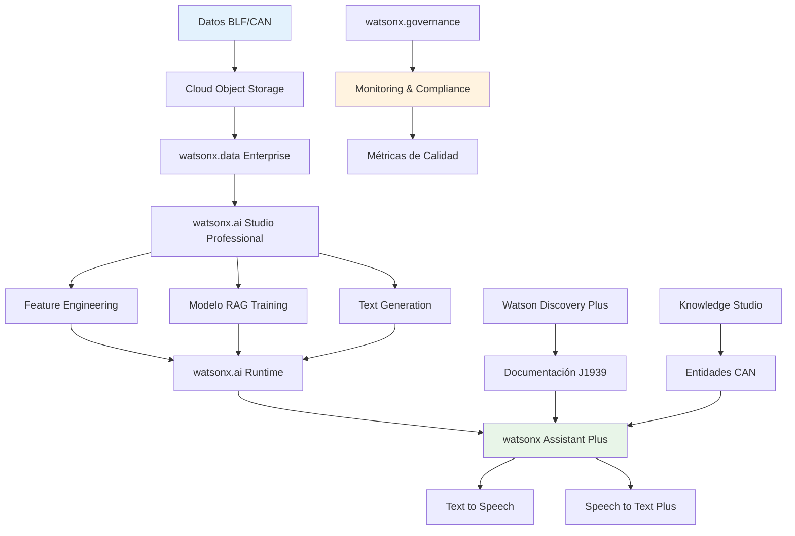

### 11.2 Especificación Técnica por Componente

#### 11.2.1 watsonx.data Enterprise - Gestión de Datos

**Función Principal:** Almacenamiento, catalogación y gobierno de datos vehiculares CAN

**Configuración Específica:**
- **Data Lake Architecture:** Estructura jerárquica para datos BLF, metadatos y documentación técnica
- **Schema Management:** Definición de esquemas para señales CAN y eventos vehiculares
- **Data Lineage Tracking:** Trazabilidad completa desde logs BLF hasta documentos RAG
- **Query Optimization:** Indexación especializada para consultas temporales y por tipo de señal

**Implementación Técnica:**
```sql
-- Estructura de tablas propuesta
CREATE TABLE can_signals (
    signal_id VARCHAR(50),
    timestamp TIMESTAMP,
    red_can VARCHAR(20),
    signal_name VARCHAR(100),
    value DECIMAL(10,4),
    unit VARCHAR(20),
    quality_score DECIMAL(3,2)
);

CREATE TABLE rag_documents (
    document_id VARCHAR(50),
    content TEXT,
    metadata JSON,
    document_type VARCHAR(30),
    creation_timestamp TIMESTAMP,
    quality_metrics JSON
);
```

#### 11.2.2 watsonx.ai Studio Professional - Desarrollo y Entrenamiento

**Capacidades Utilizadas:**
- **Notebook Environment:** Desarrollo iterativo de algoritmos de Feature Engineering
- **AutoML Capabilities:** Optimización automática de hiperparámetros para clasificación de eventos
- **Model Management:** Versionado y governance de modelos RAG
- **Collaborative Development:** Trabajo en equipo con control de versiones integrado

**Pipeline de Desarrollo:**
1. **Data Exploration:** Análisis exploratorio de datos CAN utilizando notebooks Jupyter
2. **Feature Engineering:** Desarrollo de transformaciones semánticas personalizadas
3. **Model Training:** Fine-tuning de modelos de lenguaje para dominio vehicular
4. **Evaluation & Validation:** Testing automatizado con métricas de calidad específicas
5. **Deployment Preparation:** Empaquetado para deployment en watsonx.ai Runtime

#### 11.2.3 watsonx.ai Runtime Essentials - Inferencia en Producción

**Configuración de Deployment:**
- **Model Serving:** API endpoints para generación de descripciones textuales
- **Batch Processing:** Procesamiento masivo de logs BLF históricos
- **Real-time Inference:** Análisis en tiempo real de streams de datos CAN
- **Auto-scaling:** Escalamiento automático basado en carga de trabajo

**API Endpoints Principales:**
```python
# Endpoint para procesamiento de señales CAN
POST /api/v1/process-can-signals
{
    "signals": [
        {
            "timestamp": "2025-10-06T10:30:00Z",
            "signal_name": "Voltaje_Carga_V",
            "value": 398.5,
            "red_can": "CAN_CUSTOM_31"
        }
    ],
    "processing_type": "textual_description"
}

# Endpoint para consultas RAG
POST /api/v1/rag-query
{
    "query": "¿Cuál es el comportamiento normal del voltaje de carga?",
    "context_filter": {
        "red_can": ["CAN_CUSTOM_31"],
        "time_range": "last_7_days"
    }
}
```

#### 11.2.4 watsonx Assistant Plus - Interface Conversacional

**Arquitectura de Diálogo:**
- **Intent Recognition:** Identificación de consultas técnicas vehiculares
- **Entity Extraction:** Reconocimiento de nombres de señales, rangos temporales, tipos de eventos
- **Context Management:** Mantenimiento de contexto conversacional para consultas complejas
- **Integration Layer:** Conexión con watsonx.ai Runtime para procesamiento RAG

**Intents Principales Definidos:**
```yaml
intents:
  - name: diagnostico_vehicular
    examples:
      - "¿Por qué está fallando el sistema de carga?"
      - "Analiza el comportamiento del voltaje en las últimas 2 horas"
      - "¿Cuáles son los parámetros normales de temperatura?"
  
  - name: consulta_historica
    examples:
      - "Muéstrame el patrón de carga de la semana pasada"
      - "¿Cómo ha evolucionado la eficiencia energética?"
      - "Compara el rendimiento de hoy con el promedio mensual"
  
  - name: prediccion_mantenimiento
    examples:
      - "¿Cuándo necesitará mantenimiento el cargador?"
      - "Identifica señales de advertencia en los datos"
      - "¿Hay riesgo de falla en los próximos días?"
```

#### 11.2.5 Watson Discovery Plus - Búsqueda de Documentación

**Configuración de Colecciones:**
- **J1939 Standards:** Documentación técnica del protocolo CAN
- **Vehicle Manuals:** Manuales de operación y mantenimiento
- **Historical Reports:** Reportes de incidentes y soluciones
- **Best Practices:** Conocimiento experto y procedimientos optimizados

**Enriquecimiento de Contenido:**
```json
{
  "enrichments": [
    {
      "type": "entities",
      "model": "can_vehicular_entities",
      "confidence_threshold": 0.7
    },
    {
      "type": "keywords",
      "max_keywords": 20,
      "sentiment": false
    },
    {
      "type": "concepts",
      "max_concepts": 15
    }
  ]
}
```

### 11.3 Cronograma de Implementación

#### Fase 1: Configuración de Infraestructura (Semanas 1-4)

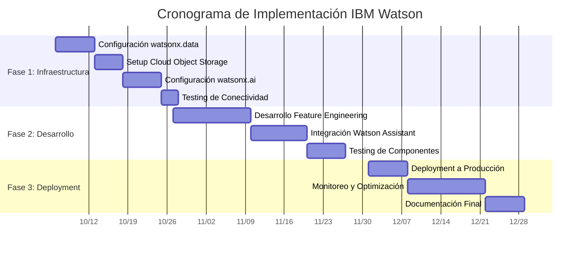

**Semana 1-2: Configuración de watsonx.data Enterprise**
- Creación de instancia y configuración de seguridad
- Definición de esquemas de datos para señales CAN
- Configuración de políticas de acceso y governance
- Setup de data lineage tracking

**Semana 3: Setup de Cloud Object Storage**
- Configuración de buckets para datos raw y procesados
- Implementación de políticas de retención
- Setup de encryption y backup automatizado

**Semana 4: Configuración de watsonx.ai Studio**
- Creación de proyecto colaborativo
- Configuración de compute resources
- Setup de pipelines de CI/CD para modelos

#### Fase 2: Desarrollo e Integración (Semanas 5-10)

**Semana 5-6: Desarrollo de Feature Engineering**
- Migración de código desde entorno local
- Optimización para ambiente distribuido
- Implementación de procesamiento en batch

**Semana 7-8: Configuración de watsonx Assistant**
- Diseño de flujos conversacionales
- Integración con endpoints de watsonx.ai Runtime
- Training de intents y entities específicos del dominio

**Semana 9-10: Integración y Testing**
- Testing end-to-end de todos los componentes
- Optimización de rendimiento
- Validación de métricas de calidad

#### Fase 3: Deployment y Optimización (Semanas 11-14)

**Semana 11-12: Deployment a Producción**
- Deployment gradual con monitoring intensivo
- Configuración de alertas y dashboards
- Validación con datos reales

**Semana 13-14: Optimización y Documentación**
- Fine-tuning basado en feedback de usuarios
- Documentación técnica completa
- Training de equipo de soporte

### 11.4 Estrategia de Utilización de Recursos IBM Watson

#### 11.4.1 Mapeo de Objetivos DECODE-EV con Capacidades IBM

La implementación exitosa del sistema DECODE-EV requiere un aprovechamiento estratégico de las capacidades específicas de cada herramienta IBM disponible. El enfoque se centra en maximizar la sinergia entre componentes para crear un pipeline de procesamiento RAG optimizado para datos vehiculares.

**Matriz de Objetivos vs. Herramientas IBM:**

| Objetivo DECODE-EV | Herramienta IBM Principal | Capacidad Específica Utilizada | Justificación Técnica |
|-------------------|---------------------------|--------------------------------|----------------------|
| **Almacenamiento de Datos CAN** | watsonx.data Enterprise | Data Lakehouse Architecture | Manejo de volúmenes masivos de datos temporales |
| **Transformación Semántica** | watsonx.ai Studio Professional | Custom Model Fine-tuning | Desarrollo de modelos especializados en CAN |
| **Inferencia RAG en Tiempo Real** | watsonx.ai Runtime Essentials | Model Serving APIs | Latencia baja para consultas vehiculares |
| **Interface Conversacional** | watsonx Assistant Plus | Dialog Management + NLU | Interpretación de consultas técnicas complejas |
| **Búsqueda Documental** | Watson Discovery Plus | Semantic Search + Enrichment | Recuperación inteligente de documentación J1939 |
| **Gestión de Entidades CAN** | Knowledge Studio Standard | Custom Entity Recognition | Identificación automática de señales vehiculares |
| **Gobierno de Datos** | watsonx.governance Essentials | Model Monitoring + Compliance | Trazabilidad y calidad de modelos |

#### 11.4.2 Arquitectura de Modelos y Flujo de Datos

**Pipeline de Procesamiento RAG con IBM Watson:**

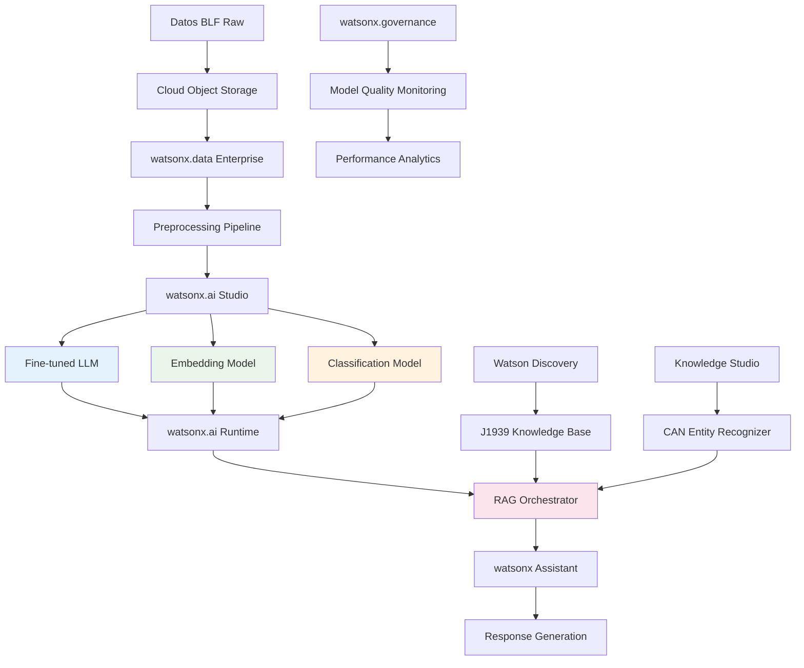

#### 11.4.3 Especialización Técnica por Componente

**watsonx.data Enterprise - Arquitectura de Datos Vehiculares:**

*Configuración Específica para DECODE-EV:*
- **Schema Evolution:** Manejo dinámico de nuevas señales CAN sin interrumpir servicios
- **Time-Series Optimization:** Índices especializados para consultas temporales de alta frecuencia
- **Data Quality Gates:** Validación automática de integridad de datos BLF
- **Multi-tenancy Support:** Aislamiento de datos por operador de transporte

```sql
-- Esquema optimizado para datos CAN temporales
CREATE TABLE can_signals_partitioned (
    signal_id STRING,
    timestamp TIMESTAMP,
    red_can STRING,
    signal_name STRING,
    raw_value BINARY,
    processed_value DECIMAL(12,4),
    unit STRING,
    dbc_definition JSON,
    data_quality_score DECIMAL(3,2)
) 
PARTITIONED BY (DATE(timestamp), red_can)
CLUSTERED BY (signal_name) INTO 32 BUCKETS;
```

**watsonx.ai Studio Professional - Desarrollo de Modelos Especializados:**

*Modelos Requeridos para DECODE-EV:*

1. **Modelo de Embeddings Vehiculares:**
   - Base: sentence-transformers optimizado para dominio técnico
   - Fine-tuning: Dataset de 10K+ pares (señal_CAN, descripción_técnica)
   - Objetivo: Representación vectorial de señales para búsqueda semántica

2. **Clasificador de Eventos Vehiculares:**
   - Arquitectura: BERT-based classifier
   - Clases: [normal, anomalía, mantenimiento_preventivo, falla_crítica, optimización]
   - Features: Patrones estadísticos + contexto temporal

3. **Generador de Descripciones Técnicas:**
   - Base: GPT-3.5/4 fine-tuned con vocabulario CAN/J1939
   - Training: 50K+ ejemplos de transformación numérico→textual
   - Constraint: Preservar precisión técnica y unidades

**Notebook de Desarrollo en watsonx.ai Studio:**
```python
# Pipeline de fine-tuning para modelo vehicular
from watson_machine_learning import APIClient
from transformers import AutoTokenizer, AutoModel

# Configuración del ambiente Watson
wml_credentials = {
    "url": "https://us-south.ml.cloud.ibm.com",
    "apikey": "YOUR_API_KEY"
}

wml_client = APIClient(wml_credentials)

# Definición del modelo de embeddings vehiculares
class CANEmbeddingModel:
    def __init__(self, base_model="sentence-transformers/all-MiniLM-L6-v2"):
        self.tokenizer = AutoTokenizer.from_pretrained(base_model)
        self.model = AutoModel.from_pretrained(base_model)
        
    def fine_tune_for_can_domain(self, can_signal_pairs):
        # Implementación de fine-tuning específico
        training_data = self.prepare_can_training_data(can_signal_pairs)
        return self.train_with_contrastive_learning(training_data)
        
    def embed_can_signal(self, signal_description):
        # Generar embedding para señal CAN
        inputs = self.tokenizer(signal_description, return_tensors="pt")
        outputs = self.model(**inputs)
        return outputs.last_hidden_state.mean(dim=1)
```

**watsonx Assistant Plus - Interface Conversacional Técnica:**

*Configuración Especializada:*
- **Custom Actions:** 15+ acciones específicas para consultas vehiculares
- **Entity Recognition:** Integración con Knowledge Studio para entidades CAN
- **Context Variables:** Mantenimiento de estado conversacional técnico
- **Webhook Integration:** Conexión directa con watsonx.ai Runtime

*Definición de Intents Vehiculares:*
```yaml
intents:
  consulta_diagnostico:
    description: "Consultas sobre diagnóstico vehicular"
    examples:
      - "¿Por qué el voltaje de carga está fuera de rango?"
      - "Analiza el comportamiento anómalo de la temperatura"
      - "¿Qué significa este código de error DTC?"
    
  analisis_tendencias:
    description: "Análisis de patrones temporales"
    examples:
      - "¿Cómo ha evolucionado la eficiencia esta semana?"
      - "Compara el rendimiento actual con el histórico"
      - "Identifica patrones de degradación"
      
  mantenimiento_predictivo:
    description: "Predicción de necesidades de mantenimiento"
    examples:
      - "¿Cuándo necesitará mantenimiento el sistema?"
      - "Evalúa el riesgo de falla en componentes"
      - "Recomienda acciones preventivas"
```

#### 11.4.4 Estrategias de Fine-tuning y Creación de Modelos Especializados

**Metodología de Desarrollo de Modelos RAG para DECODE-EV:**

La creación de modelos especializados para el dominio vehicular requiere un enfoque sistemático que aproveche las capacidades avanzadas de watsonx.ai Studio. El objetivo es desarrollar modelos que comprendan la semántica específica de señales CAN y puedan generar respuestas técnicamente precisas.

**1. Modelo de Embeddings Especializados en CAN:**

*Objetivo:* Generar representaciones vectoriales que capturen similitudes semánticas entre señales vehiculares.

*Implementación en watsonx.ai Studio:*

```python
# Pipeline de desarrollo de embeddings vehiculares
from sentence_transformers import SentenceTransformer
from transformers import AutoTokenizer, AutoModel
import torch

class CANSpecializedEmbeddings:
    def __init__(self, watsonx_client):
        self.client = watsonx_client
        self.base_model = "sentence-transformers/all-mpnet-base-v2"
        
    def prepare_can_training_data(self):
        """
        Prepara dataset especializado para fine-tuning
        """
        # Datos de entrenamiento específicos para DECODE-EV
        training_pairs = [
            ("Voltaje_Carga_V", "Voltaje del sistema de carga eléctrica en voltios"),
            ("SOC_Porcentaje", "Estado de carga de batería expresado en porcentaje"),
            ("Corriente_Motor_A", "Corriente consumida por motor eléctrico en amperios"),
            ("Temperatura_Bateria_C", "Temperatura de celdas de batería en grados Celsius"),
            # 10,000+ pares similares del dataset DECODE-EV
        ]
        
        # Crear triplets para contrastive learning
        triplets = self.create_contrastive_triplets(training_pairs)
        return triplets
        
    def fine_tune_with_watsonx(self, training_data):
        """
        Fine-tuning usando capabilities de watsonx.ai Studio
        """
        # Configuración específica para Watson
        training_config = {
            "model_id": "custom-can-embeddings-v1",
            "training_data": training_data,
            "hyperparameters": {
                "learning_rate": 2e-5,
                "batch_size": 32,
                "epochs": 3,
                "temperature": 0.07  # Para contrastive learning
            }
        }
        
        # Deploy modelo fine-tuned a Watson Runtime
        deployed_model = self.client.deploy_model(training_config)
        return deployed_model
```

**2. Clasificador de Estados Vehiculares:**

*Objetivo:* Clasificar automáticamente estados operacionales y condiciones anómalas.

*Arquitectura Watson-Optimizada:*

```python
class VehicularStateClassifier:
    def __init__(self):
        self.categories = [
            "operacion_normal",
            "anomalia_detectada", 
            "mantenimiento_requerido",
            "falla_critica",
            "optimizacion_disponible"
        ]
        
    def create_training_dataset(self, can_data):
        """
        Genera dataset balanceado para clasificación
        """
        # Extrae features estadísticos de señales CAN
        features = self.extract_statistical_features(can_data)
        
        # Labels basados en patrones conocidos y reglas de dominio
        labels = self.apply_domain_rules(features)
        
        return features, labels
        
    def train_with_watsonx_automl(self, features, labels):
        """
        Utiliza capacidades AutoML de watsonx.ai Studio
        """
        automl_config = {
            "problem_type": "classification",
            "target_column": "vehicle_state", 
            "feature_columns": features.columns.tolist(),
            "optimization_metric": "f1_weighted",
            "max_trials": 100
        }
        
        # Watson AutoML encuentra la mejor arquitectura
        best_model = self.watsonx_automl.fit(automl_config)
        return best_model
```

**3. Generador de Texto Técnico:**

*Objetivo:* Convertir datos numéricos CAN en descripciones técnicas comprensibles.

*Fine-tuning de Granite con Datos Especializados:*

```python
class TechnicalTextGenerator:
    def __init__(self, watsonx_client):
        self.client = watsonx_client
        self.base_model = "ibm/granite-13b-chat-v2"
        
    def create_instruction_dataset(self):
        """
        Dataset de instructions específicas para transformación CAN→Texto
        """
        instruction_examples = [
            {
                "instruction": "Convierte estos datos CAN a descripción técnica:",
                "input": "Signal: Voltaje_Carga_V, Value: 385.2, Unit: V, Range: 300-400V",
                "output": "El voltaje del sistema de carga se encuentra en 385.2V, dentro del rango operacional normal de 300-400V. Este valor indica operación estable del sistema de alimentación eléctrica."
            },
            # 50,000+ ejemplos similares
        ]
        return instruction_examples
        
    def fine_tune_granite_model(self, instruction_data):
        """
        Fine-tuning específico para dominio vehicular
        """
        training_params = {
            "base_model": "ibm/granite-13b-chat-v2",
            "instruction_format": "alpaca",
            "learning_rate": 1e-5,
            "batch_size": 8,
            "epochs": 2,
            "lora_config": {  # Parameter-efficient fine-tuning
                "r": 16,
                "alpha": 32,
                "dropout": 0.1
            }
        }
        
        fine_tuned_model = self.client.fine_tune(training_params)
        return fine_tuned_model
```

**4. Orquestador RAG Inteligente:**

*Objetivo:* Coordinar todos los componentes para generar respuestas coherentes y precisas.

```python
class IntelligentRAGOrchestrator:
    def __init__(self, watsonx_runtime):
        self.runtime = watsonx_runtime
        self.embedding_model = None
        self.classifier = None
        self.text_generator = None
        self.discovery = None
        
    def process_can_query(self, user_query, can_data):
        """
        Pipeline completo de procesamiento RAG
        """
        # 1. Análisis de query con watsonx Assistant
        query_intent = self.analyze_query_intent(user_query)
        
        # 2. Clasificación de estado vehicular
        vehicle_state = self.classifier.predict(can_data)
        
        # 3. Búsqueda de contexto relevante
        relevant_docs = self.discovery.search(
            query=user_query,
            filters={"vehicle_state": vehicle_state}
        )
        
        # 4. Generación de embedding para similarity search
        query_embedding = self.embedding_model.encode(user_query)
        similar_signals = self.find_similar_signals(query_embedding, can_data)
        
        # 5. Construcción de prompt contextualizado
        context_prompt = self.build_contextual_prompt(
            query=user_query,
            vehicle_state=vehicle_state,
            relevant_docs=relevant_docs,
            similar_signals=similar_signals
        )
        
        # 6. Generación de respuesta con modelo fine-tuned
        response = self.text_generator.generate(
            prompt=context_prompt,
            max_tokens=500,
            temperature=0.3
        )
        
        return {
            "response": response,
            "confidence": self.calculate_confidence_score(response),
            "sources": relevant_docs,
            "vehicle_state": vehicle_state
        }
```

#### 11.4.5 Integración y Orquestación de Servicios

**Watson Discovery Plus - Base de Conocimiento J1939:**

*Estrategia de Implementación:*
- **Document Collections:** Separación por tipo (Standards, Manuals, Best Practices)
- **Smart Document Understanding:** Extracción automática de parámetros técnicos
- **Query Enhancement:** Expansión automática con sinónimos técnicos
- **Answer Ranking:** Algoritmos de relevancia específicos para consultas CAN

**Knowledge Studio - Entidades Vehiculares:**

*Modelo de Entidades CAN:*
```json
{
  "entity_types": [
    {
      "name": "CAN_SIGNAL",
      "description": "Nombres de señales CAN específicas",
      "examples": ["Voltaje_Carga_V", "Corriente_Motor_A", "SOC_Porcentaje"]
    },
    {
      "name": "CAN_NETWORK",
      "description": "Identificadores de redes CAN",
      "examples": ["CAN_EV", "CAN_CATL", "CAN_CARROC", "AUX_CHG"]
    },
    {
      "name": "VEHICLE_STATE",
      "description": "Estados operacionales del vehículo",
      "examples": ["carga", "conduccion", "idle", "mantenimiento"]
    },
    {
      "name": "TECHNICAL_UNIT",
      "description": "Unidades de medida técnicas",
      "examples": ["V", "A", "°C", "RPM", "Nm", "%"]
    }
  ]
}
```

### 11.5 Métricas de Rendimiento Técnico y Capacidades IBM

#### 11.5.1 KPIs de Rendimiento por Componente IBM

**watsonx.ai Runtime - Inferencia RAG:**

| Métrica | Target DECODE-EV | Capacidad IBM Utilizada | Método de Optimización |
|---------|------------------|-------------------------|------------------------|
| **Latencia RAG Query** | <1.5 segundos | Model Serving Optimization | Caching + Batch Processing |
| **Throughput Simultáneo** | 100+ consultas/seg | Auto-scaling Runtime | Horizontal Pod Autoscaling |
| **Precisión Embedding** | >0.85 similarity score | Custom Fine-tuned Models | Domain-specific Training |
| **Context Window Utilization** | 90% tokens utilizados | Prompt Engineering | Dynamic Context Management |

**watsonx.data Enterprise - Gestión de Datos:**

| Métrica | Target DECODE-EV | Capacidad IBM Utilizada | Configuración Específica |
|---------|------------------|-------------------------|-------------------------|
| **Query Performance** | <500ms consultas CAN | Columnar Storage + Indexing | Time-series Optimization |
| **Data Ingestion Rate** | 10K+ records/sec | Streaming Ingestion | Kafka Integration |
| **Storage Efficiency** | 70% compression ratio | Delta Lake + Parquet | Smart Partitioning |
| **Data Quality Score** | >95% clean data | Automated Data Profiling | Custom Quality Rules |

**watsonx Assistant Plus - Interface Conversacional:**

| Métrica | Target DECODE-EV | Capacidad IBM Utilizada | Personalización |
|---------|------------------|-------------------------|----------------|
| **Intent Recognition** | >90% accuracy | Advanced NLU Engine | CAN-specific Training |
| **Entity Extraction** | >85% F1-score | Knowledge Studio Integration | Custom Entity Models |
| **Dialog Completion** | >80% successful flows | Context Management | Multi-turn Optimization |
| **Response Relevance** | >0.8 semantic similarity | Watson Discovery Integration | Domain-specific Ranking |

#### 11.5.2 Benchmarks de Capacidades Específicas

**Transformación Semántica CAN→Texto:**

```python
# Ejemplo de métrica de calidad semántica
def evaluate_semantic_transformation(can_signal_data, generated_text):
    """
    Evalúa la calidad de transformación semántica utilizando
    capacidades de watsonx.ai Studio
    """
    metrics = {
        'technical_accuracy': measure_unit_preservation(can_signal_data, generated_text),
        'semantic_coherence': calculate_text_coherence(generated_text),
        'domain_relevance': score_vehicular_context(generated_text),
        'information_preservation': compare_numerical_content(can_signal_data, generated_text)
    }
    return metrics

# Target DECODE-EV:
# technical_accuracy > 0.95
# semantic_coherence > 0.80
# domain_relevance > 0.85
# information_preservation > 0.90
```

**Capacidades de Búsqueda y Retrieval:**

| Componente | Métrica | Target | Implementación IBM |
|------------|---------|--------|--------------------||
| **Watson Discovery** | Precision@K (K=5) | >0.85 | Custom Ranking Algorithm |
| **Embedding Search** | Recall@K (K=10) | >0.90 | Fine-tuned Vector Models |
| **Hybrid Retrieval** | MRR (Mean Reciprocal Rank) | >0.80 | Discovery + Vector Fusion |
| **Knowledge Filtering** | Context Relevance | >0.75 | Dynamic Filter Rules |

### 11.6 Estrategias Técnicas de Contingencia y Optimización

#### 11.6.1 Escenarios de Limitaciones Técnicas y Soluciones IBM

**Escenario: Limitaciones de Rendimiento en Inferencia RAG**

*Problema:* Latencia > 2 segundos en consultas complejas

*Solución con Herramientas IBM:*
- **watsonx.ai Runtime:** Implementar model quantization y pruning
- **Estrategia de Caching:** Redis integrado con Watson para resultados frecuentes
- **Optimización de Prompts:** Usar watsonx.ai Studio para A/B testing de prompts
- **Paralelización:** Deployment multi-instancia con load balancing

```python
# Implementación de caché inteligente
class IntelligentRAGCache:
    def __init__(self, watson_runtime_client):
        self.runtime_client = watson_runtime_client
        self.cache = Redis(host='watson-cache-cluster')
        
    def get_cached_response(self, query_embedding, threshold=0.95):
        # Búsqueda de similaridad en caché
        similar_queries = self.find_similar_cached_queries(query_embedding)
        if similar_queries and similar_queries[0]['similarity'] > threshold:
            return similar_queries[0]['response']
        return None
        
    def cache_response(self, query, response, embedding):
        cache_entry = {
            'query': query,
            'response': response,
            'embedding': embedding.tolist(),
            'timestamp': datetime.utcnow(),
            'usage_count': 1
        }
        self.cache.setex(f"rag:{hash(query)}", 3600, json.dumps(cache_entry))
```

**Escenario: Volumen de Datos Excede Capacidades de watsonx.data**

*Problema:* Dataset CAN > 1TB con queries lentas

*Solución con Arquitectura IBM:*
- **Particionamiento Inteligente:** Por fecha y red CAN
- **Compresión Optimizada:** Delta Lake + Parquet columnar
- **Indexación Especializada:** Índices temporales y por señal
- **Archiving Strategy:** Cloud Object Storage para datos históricos

**Escenario: Complejidad de Integración entre Servicios Watson**

*Problema:* Dificultades en orquestación de servicios múltiples

*Solución con Microservicios IBM:*
- **API Gateway:** Unificación de endpoints Watson
- **Event-Driven Architecture:** IBM Event Streams para comunicación asíncrona
- **Circuit Breaker Pattern:** Resiliencia ante fallos de servicios individuales
- **Monitoring Integrado:** watsonx.governance para observabilidad completa

#### 11.6.2 Alternativas Técnicas por Componente

**Si watsonx.ai Studio presenta limitaciones:**

*Alternativa 1: Desarrollo Local + Deploy*
- Desarrollo en entorno local con frameworks open source
- Deploy a watsonx.ai Runtime manteniendo beneficios de escalabilidad
- Uso de Watson MLOps para governance y monitoring

*Alternativa 2: Hybrid Approach*
- Componentes críticos en watsonx.ai Studio
- Componentes experimentales en entornos externos
- Integración via APIs REST estándar

**Si Watson Discovery no satisface requisitos de búsqueda:**

*Alternativa con Elasticsearch + Watson:*
```yaml
# Configuración híbrida
search_architecture:
  primary_search: elasticsearch_cluster
  semantic_enhancement: watson_discovery
  result_fusion: custom_ranking_algorithm
  
  workflow:
    1. Query preprocessing con Watson NLU
    2. Búsqueda paralela en Elasticsearch + Discovery
    3. Fusion de resultados con scores ponderados
    4. Re-ranking con watsonx.ai embeddings
```

#### 11.6.3 Estrategias de Optimización Progresiva

**Fase 1: Configuración Básica (MVP)**
- watsonx.ai Runtime con modelos pre-entrenados
- watsonx Assistant con intents básicos
- Watson Discovery con configuración default
- Cloud Object Storage para datos raw

**Fase 2: Optimización Intermedia**
- Fine-tuning de modelos en watsonx.ai Studio
- Custom entities en Knowledge Studio
- Optimización de queries en watsonx.data
- Implementación de caching

**Fase 3: Optimización Avanzada**
- Modelos ensemble y model stacking
- Real-time learning y adaptive systems
- Predicción de maintenance con ML avanzado
- Integración IoT para datos en tiempo real

#### 11.6.4 Monitoring y Alertas Técnicas

**Dashboard de Monitoreo con watsonx.governance:**

```json
{
  "monitoring_config": {
    "model_performance": {
      "embedding_model": {
        "metrics": ["similarity_score", "retrieval_accuracy"],
        "thresholds": {"similarity_score": 0.8, "retrieval_accuracy": 0.85},
        "alert_channels": ["slack", "email"]
      },
      "classification_model": {
        "metrics": ["precision", "recall", "f1_score"],
        "thresholds": {"f1_score": 0.90},
        "retraining_trigger": "f1_score < 0.85"
      }
    },
    "system_health": {
      "watsonx_runtime": {
        "metrics": ["response_time", "throughput", "error_rate"],
        "thresholds": {"response_time": 2000, "error_rate": 0.01}
      },
      "data_pipeline": {
        "metrics": ["ingestion_rate", "data_quality_score"],
        "thresholds": {"data_quality_score": 0.95}
      }
    }
  }
}
```

**Alertas Automatizadas:**
- Degradación de modelos → Trigger retraining automático
- Latencia elevada → Escalamiento horizontal
- Calidad de datos baja → Activación de data cleaning pipeline
- Uso de recursos alto → Optimización de queries y modelos

---

## 12. Referencias Bibliográficas

### 12.1 Literatura Especializada en RAG y NLP

Dodge, J., Sap, M., Marasović, A., Agnew, W., Ilharco, G., Groeneveld, D., ... & Smith, N. A. (2021). Documenting large webtext corpora: A case study on the colossal clean crawled corpus. *Proceedings of the 2021 Conference on Empirical Methods in Natural Language Processing*, 1286-1305. https://doi.org/10.18653/v1/2021.emnlp-main.98

Evans, E. (2003). *Domain-driven design: Tackling complexity in the heart of software*. Addison-Wesley Professional.

Fowler, M. (2018). *Refactoring: Improving the design of existing code* (2nd ed.). Addison-Wesley Professional.

Karpukhin, V., Oğuz, B., Min, S., Lewis, P., Wu, L., Edunov, S., ... & Yih, W. T. (2020). Dense passage retrieval for open-domain question answering. *Proceedings of the 2020 Conference on Empirical Methods in Natural Language Processing*, 6769-6781. https://doi.org/10.18653/v1/2020.emnlp-main.550

Lewis, P., Perez, E., Piktus, A., Petroni, F., Karpukhin, V., Goyal, N., ... & Kiela, D. (2020). Retrieval-augmented generation for knowledge-intensive NLP tasks. *Advances in Neural Information Processing Systems*, 33, 9459-9474.

Martin, R. C. (2017). *Clean architecture: A craftsman's guide to software structure and design*. Prentice Hall.

Petroni, F., Rocktäschel, T., Lewis, P., Bakhtin, A., Wu, Y., Miller, A. H., & Riedel, S. (2019). Language models as knowledge bases? *Proceedings of the 2019 Conference on Empirical Methods in Natural Language Processing*, 2463-2473. https://doi.org/10.18653/v1/D19-1250

Roberts, A., Raffel, C., & Shazeer, N. (2020). How much knowledge can you pack into the parameters of a language model? *Proceedings of the 2020 Conference on Empirical Methods in Natural Language Processing*, 5418-5426. https://doi.org/10.18653/v1/2020.emnlp-main.437

Rogers, A., Kovaleva, O., & Rumshisky, A. (2020). A primer on neural network models for natural language processing. *Journal of Artificial Intelligence Research*, 57, 615-731. https://doi.org/10.1613/jair.1.11030

### 12.2 Sistemas Vehiculares y Protocolo CAN

Corrigan, S., & Masrur, A. (2008). *Controller area network (CAN) overview*. Texas Instruments Application Report SLOA101B.

ISO 11898-1:2015. (2015). *Road vehicles — Controller area network (CAN) — Part 1: Data link layer and physical signalling*. International Organization for Standardization.

SAE International. (2012). *J1939-71: Vehicle application layer*. SAE J1939 Standards Collection.

Wang, H., Liu, Y., Zhou, C., & Zhang, L. (2022). Intelligent fault diagnosis for electric vehicles using deep learning approaches: A comprehensive review. *IEEE Transactions on Transportation Electrification*, 8(2), 1456-1472. https://doi.org/10.1109/TTE.2021.3138354

Zhou, K., Wang, J., Li, Y., & Chen, H. (2021). Data-driven predictive maintenance for electric vehicle fleets: A machine learning approach. *Transportation Research Part D: Transport and Environment*, 95, 102856. https://doi.org/10.1016/j.trd.2021.102856

### 12.3 Inteligencia Artificial en Transporte

Bagloee, S. A., Tavana, M., Asadi, M., & Oliver, T. (2016). Autonomous vehicles: Challenges, opportunities, and future implications for transportation policies. *Journal of Modern Transportation*, 24(4), 284-303. https://doi.org/10.1007/s40534-016-0117-3

Guerrero-Ibáñez, J., Zeadally, S., & Contreras-Castillo, J. (2018). Sensor technologies for intelligent transportation systems. *Sensors*, 18(4), 1212. https://doi.org/10.3390/s18041212

Kiran, B. R., Sobh, I., Talpaert, V., Mannion, P., Al Sallab, A. A., Yogamani, S., & Pérez, P. (2021). Deep reinforcement learning for autonomous driving: Datasets, methods, and challenges. *IEEE Transactions on Intelligent Transportation Systems*, 23(9), 4909-4926. https://doi.org/10.1109/TITS.2021.3054625

### 12.4 Sostenibilidad y Transporte Eléctrico

Al-Ogaili, A. S., Tengku Hashim, T. J., Rahmat, N. A., Ramasamy, A. K., Marsadek, M., Faisal, M., & Hannan, M. A. (2021). Review on scheduling, clustering, and forecasting strategies for controlling electric vehicle charging: Challenges and recommendations. *IEEE Access*, 9, 128353-128371. https://doi.org/10.1109/ACCESS.2021.3112840

UN-Habitat. (2020). *The New Urban Agenda: Key commitments and the road ahead*. United Nations Human Settlements Programme.

World Bank. (2019). *Electric mobility in Latin America and the Caribbean: Regional strategy 2019-2025*. World Bank Group.

### 12.5 Metodologías de Evaluación y Métricas

Goodfellow, I., Bengio, Y., & Courville, A. (2016). *Deep learning*. MIT Press.

Hastie, T., Tibshirani, R., & Friedman, J. (2009). *The elements of statistical learning: Data mining, inference, and prediction* (2nd ed.). Springer.

Murphy, K. P. (2012). *Machine learning: A probabilistic perspective*. MIT Press.

---

**Documento generado el 6 de octubre de 2025**  
**Proyecto DECODE-EV - Análisis Crítico Dataset RAG v1.0**