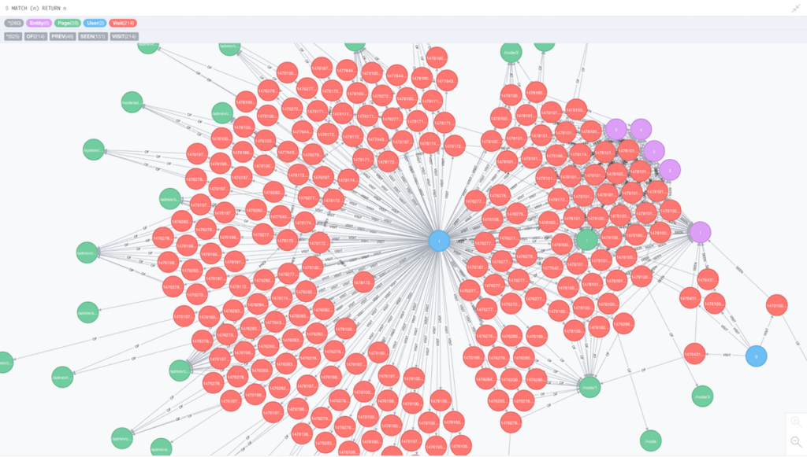
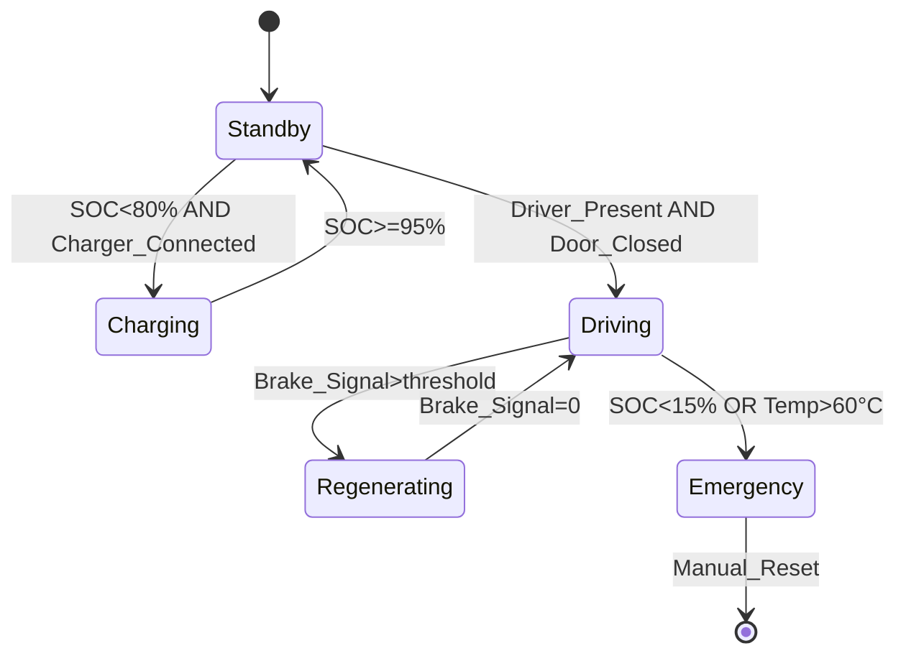
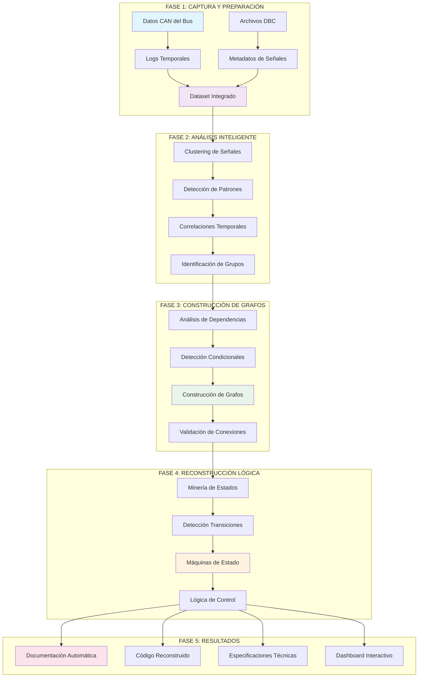
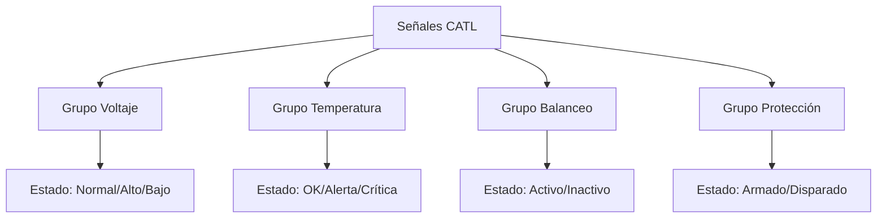
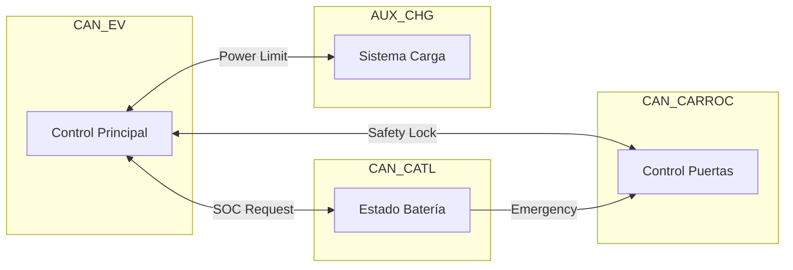
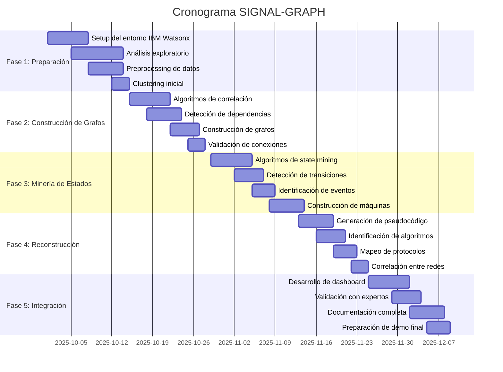

# Propuesta de PI

## 1. Descripción de la propuesta

### 1.1. Titulo de la propuesta

Modelo de reconstrucción de lógica mediante  grafos de señales y máquinas de estado.

<aside>
💡

Enfocar el proyecto en: EXPLORAR  EVENTOS DEL CAN CON PROCESAMIENTO DE LENGUAJE NATURAL 

</aside>

<aside>
💡

Enfocarnos inicialmente en el contexto del RAG

Henry revisará si es posible que la empresa nos ayude con las normas J1939

Convertir los logs de .BLF a .MAT y algún otro formato para comparar cual nos sirve mejor 

TODOS: 

- [ ]  Leer e investigar sobre el nuevo contexto de desarrollo de nuestro PI para ir construyendo el estado del arte y el marco de referencia
- [ ]  Crear cuenta e instalar Mendeley Reference Manager https://www.mendeley.com/?interaction_required=true y aprender como funciona;
</aside>

### 1.2. Descripción del alcance:

Sistema de IA que construye grafos dinámicos  de relaciones entre variables CAN, detecta activaciones condicionales y reconstruye automáticamente máquinas de estado y lógica de control embebida desde el agrupamiento inteligente de señales. Puntualmente se encargará de: 

1. Agrupa señales similares: Como un organizador que clasifica las señales en categorías funcionales (Torque, Potencia, Tracción, Baterias, etc) 
2. Encuentra conexiones: Descubre por ejemplo que cuando la señal A cambia, siempre cambian las señales B y C. 
3. Dibuja mapas de relaciones: Crea diagramas que muestran como se comunican las partes del bus. 
4. Reconstruye el “Cerebro del BUS”: Entiende las reglas que sigue el bus para tomar decisiones

Nuestro sistema puede:

- Entender automáticamente la lógica en días, no meses
- Trabajar solo con datos que se capturan del bus en operación
- Generar documentación técnica automáticamente
- Funcionar con cualquier fabricante sin conocimiento previo

Nuestro sistema permite: 

- Acelera desarrollo de nuevos buses eléctricos
- Facilita mantenimiento predictivo avanzado
- Reduce costos de ingeniería inversa en 90%
- Democratiza el conocimiento técnico automotriz

## 2. Conceptos técnicos aplicados

### 2.1 ¿Qué son los “Grafos de Señales”?



```
[Temperatura Motor] ---> [Velocidad Ventilador]
        |
        v
[Alerta de Sobrecalentamiento]
```

Estructuras matemáticas que representan relaciones entre variables CAN mediante nodos y aristas direccionales.

<aside>
💡

Son como **mapas de conexiones** donde:
- Cada círculo (nodo) = una señal del bus (como “velocidad”, “temperatura”, “estado de batería”)
- Cada flecha (arista) = una conexión entre señales (como “cuando X sube, Y también sube”)
- Las flechas pueden tener números que indican qué tan fuerte es la conexión

</aside>

### 2.2 ¿Qué son las “Activaciones Condicionales”?

Patrones donde una señal cambia de estado únicamente cuando se cumplen condiciones específicas en otras señales.


Son como **reglas “Si… entonces…”** que sigue el bus:
- “**Si** la batería está bajo 20%, **entonces** activa modo ahorro de energía”
- “**Si** la temperatura sube mucho **Y** la velocidad es alta, **entonces** enciende el ventilador extra”
- “**Si** se presiona el freno **Y** el bus va rápido, **entonces** activa recuperación de energía”

### 2.3 ¿Qué son las “Máquinas de Estado”?



Modelos computacionales que describen el comportamiento de un sistema mediante estados discretos y transiciones entre ellos.

Son como modos de operación del bus. Imagina que el bus es como una persona que puede estar en diferentes estados de ánimo:
- Estado “Durmiendo”: Apagado en el garaje
- Estado “Despertando”: Encendiendo sistemas
- Estado “Trabajando”: Transportando pasajeros
- Estado “Descansando”: En parada con puertas abiertas
- Estado “Alerta”: Detectó un problema

Premisa: El bus solo puede estar en un estado a la vez y cambia entre estados por razones específicas.

### 2.4 ¿Qué es el “Agrupamiento Inteligente”?


Algoritmos de clustering que identifican conjuntos de señales con comportamiento temporal y funcional similar.

Es como organizar automáticamente todas las señales en carpetas por tema:
- Carpeta “Batería”: Todas las señales relacionadas con energía
- Carpeta “Motor”: Señales de propulsión y movimiento

- Carpeta “Seguridad”: Señales de frenos, puertas, alarmas
- Carpeta “Confort”: Aire acondicionado, luces, sonido

## Flujo de trabajo completo



## 3. Descripción de las fases

| **Fase** | **Actividades** | **Entregables** |
| --- | --- | --- |
| **FASE 1: CAPTURA Y PREPARACIÓN**(Semanas 1-2) | - Toma los datos del bus eléctrico
- Lee los archivos DBC de las 4 redes CAN
- Combina toda la información en un formato que la IA puede entender | - Dataset procesado
- Base de datos integrada
- Estructura para análisis |
| **FASE 2: ANÁLISIS INTELIGENTE**(Semanas 2-3) | -**Clustering:**Agrupa señales similares
-**Patrones:**Encuentra secuencias repetitivas
-**Correlaciones:**Identifica señales que cambian juntas
-**Grupos funcionales:**Organiza señales por propósito | - Grupos de señales identificados
- Patrones temporales detectados
- Matriz de correlaciones
- Clasificación funcional |
| **FASE 3: CONSTRUCCIÓN DE GRAFOS**(Semanas 4-5) | -**Dependencias:**Identificación de influencias entre señales
-**Condicionales:**Detección de causas y efectos
-**Grafos:**Creación de mapas de conexiones
-**Validación:**Verificación de relaciones | - Mapas de dependencias
- Reglas condicionales
- Grafos de relaciones
- Informe de validación |
| **FASE 4: RECONSTRUCCIÓN LÓGICA**(Semanas 6-7) | -**Estados:**Identificación de modos de operación
-**Transiciones:**Detección de cambios entre estados
-**Máquinas de estado:**Construcción de modelos
-**Lógica:**Extracción de reglas de programación | - Catálogo de estados
- Mapa de transiciones
- Máquinas de estado completas
- Reglas lógicas extraídas |
| **FASE 5: RESULTADOS**(Semanas 8-10) | - Generación de documentación técnica
- Creación de pseudocódigo
- Elaboración de especificaciones- Desarrollo de dashboard interactivo | -**Documentación:**Manuales técnicos
-**Código:**Pseudocódigo reconstruido
-**Especificaciones:**Documentos para certificación
-**Dashboard:**Herramienta interactiva |

## 4. Tecnologías IBM Watsonx Utilizadas

| **Tecnología** | **Descripción** | **Aplicación** |
| --- | --- | --- |
| **Watson Studio** 
Laboratorio de Análisis | **¿Qué hace?**
Es como un laboratorio digital donde se desarrollan y se prueban los algoritmos de IA. | **¿Cómo se usa?**
- Notebooks Jupyter para análisis exploratorio
- Herramientas de visualización de grafos
- Algoritmos de machine learning
- Pruebas y validación de resultados |
| [**Watsonx.ai](http://Watsonx.ai)** 
Motor de Inteligencia | **¿Qué hace?**
Es el cerebro que entiende patrones complejos en los datos. | **¿Cómo se usa?**
- Graph Neural Networks para análisis de conexiones
- Transformers para patrones temporales
- Clustering inteligente de señales
- Detección automática de estados |
| **Watson Knowledge Catalog** Biblioteca Organizada | **¿Qué hace?**
Guarda y organiza todo el conocimiento generado de forma ordenada y segura. | **¿Cómo se usa?**
- Almacena patrones de comportamiento encontrados
- Organiza bibliotecas de máquinas de estado
- Controla versiones de los modelos
- Facilita reutilización en otros proyectos |
| **Watson Discovery** Motor de Búsqueda Inteligente | **¿Qué hace?**
Encuentra información relevante en grandes cantidades de datos y documentos. | **¿Cómo se usa?**
- Indexa logs históricos de múltiples buses
- Busca patrones similares en otros vehículos
- Correlaciona con documentación técnica existente
- Identifica anomalías y comportamientos únicos |

---

## 5. Casos de Uso Específicos con tus Datos

### 5.1 Red CAN_CATL (162 señales - 0% documentación)

**El Desafío:**
Esta red maneja la batería pero no tiene documentación. Es como tener una caja cerrada.



Lo que se logrará: 
- **15-20 estados** identificados automáticamente
- **Lógica de protección** reconstruida
- **Algoritmo de balanceo** de celdas descubierto
- **Condiciones de alarma** mapeadas

### 5.2 Red CAN_EV (1,957 señales - 30% documentación)

**El Desafío:**
Es la red más compleja, con muchas señales pero documentación incompleta.

Lo que se logrará: 
- **Estados del motor:** Idle → Starting → Running → Max_Power → Regenerating
- **Lógica de limitación:** Cómo se reduce potencia por temperatura/SOC
- **Control de temperatura:** Cuándo y cómo se activa enfriamiento
- **Protocolos de seguridad:** Secuencias de parada de emergencia

### 5.3 Integración Multi-Red

**El Desafío:**
Las 4 redes deben coordinarse, pero no sabemos cómo se comunican.

Lo que se logrará: 



---

## 6. Cronograma Detallado de 10 Semanas



## 7. Riesgos y Mitigación

### 7.1 **Riesgos Técnicos y Mitigación**

| **Riesgo** | **Impacto** | **Mitigación** |
| --- | --- | --- |
| Datos insuficientes para algoritmos de IA | Alto | Enfoque incremental, empezando con señales conocidas (SOC) y expandiendo gradualmente |
| Complejidad computacional alta para grafos grandes | Medio | Procesamiento por subsistemas y uso eficiente de recursos Watson |
| Validación de resultados sin ground truth completa | Medio | Validación cruzada con expertos de Superollo y comportamientos conocidos |

### 7.2 **Riesgos de Proyecto y Mitigación**

| **Riesgo** | **Impacto** | **Mitigación** |
| --- | --- | --- |
| Tiempo limitado (10 semanas) | Alto | Alcance bien definido, enfoque en value delivery incremental |
| Curva de aprendizaje de IBM Watsonx | Medio | Training intensivo primeras 2 semanas, soporte IBM disponible |
| Acceso a datos adicionales si se requiere | Bajo | Trabajo estrecho con equipo técnico de Superollo desde el inicio |

---